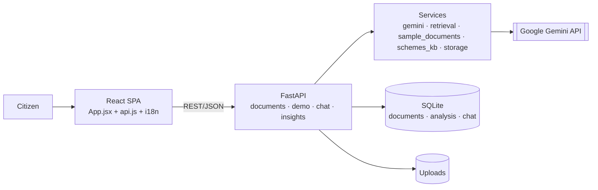

# JanMitra AI — Hackathon Pitch

> *"Your friend for understanding the documents that decide your money, your rights, and your future."*

## Elevator Pitch

Every day, millions of Indians hold a piece of paper they cannot fully understand — a loan renewal notice, a rental agreement, a ration-card letter, an insurance policy. The language is legal, financial, and bureaucratic; the stakes are real money, real rights, and real deadlines. Most people either guess, pay an agent, or do nothing until it's too late.

**JanMitra AI** ("People's Friend") turns any such document into clear, multilingual guidance. Upload a PDF or photo — or try a curated demo — and within seconds you get a plain-language snapshot, a ranked list of risks, your rights and responsibilities, a step-by-step action plan, matched government schemes, and a chat assistant that answers questions *using only what your document actually says*, with citations, in your language: English, Hindi, Bengali, Marathi, Tamil, or Telugu.

Crucially, JanMitra is honest about what it is: an **educational first step**, not a lawyer. It never invents facts, refuses to answer beyond the document, and constantly reminds users to verify with official sources — making it safe enough to put in front of vulnerable citizens.

## Problem

- **The pain:** Formal documents are written for institutions, not citizens. A farmer with a Kisan Credit Card notice, a tenant with a lease, or a family updating a ration card faces dense terms, hidden penalties, and silent deadlines.
- **Why it's important:** Misunderstanding these documents leads to missed subsidies, lost deposits, late-payment penalties, fraud (e.g., OTP scams), and forfeited benefits — outcomes that hit low-income and low-literacy citizens hardest.
- **Who is affected:** Farmers, tenants, first-time banking users, and rural/semi-urban households — plus the NGOs, volunteers, and help-desk operators who assist them.

## Existing Solutions

- **Hire a professional / agent:** costs money, isn't always trustworthy, and isn't available on demand.
- **Generic translation or generic chatbots:** translate words but don't extract risks, rights, deadlines, or matched schemes — and they hallucinate, which is dangerous for legal/financial content.
- **Government portals:** authoritative but fragmented, English-heavy, and assume you already know which scheme or office applies.

None of these give a citizen, in their own language, a grounded, document-specific "what does this mean and what do I do next?" — safely.

## Our Solution

JanMitra AI reads the document *with* the citizen. A React web app talks to a FastAPI backend that uses **Google Gemini** to extract structure from PDFs/images and to generate six things, all grounded in the document text and translated into the user's language:

1. **Snapshot** — type, parties, dates, amounts, key clauses.
2. **Risks** — ranked Low/Medium/High with evidence quotes.
3. **Rights & Responsibilities** — what you must do, what the other party must do, deadlines, consequences.
4. **Action Plan** — immediate steps, documents to collect, deadlines, questions to ask, how to verify.
5. **Government Schemes** — matched from a curated catalog of real central schemes, personalized by your profile.
6. **Ask the Doc** — grounded chat with citations and a "not in this document" guardrail.

## Key Capabilities

- Multimodal document understanding (PDF + images) via Gemini.
- Six-language UI and generated content, with browser text-to-speech.
- Deterministic **demo mode** (KCC notice, rental agreement, ration-card update) for instant, reliable judging.
- Profile-aware scheme matching (state, age, occupation, income, category, residence, gender).
- Reading-level adaptation (Basic / Standard / Advanced).
- Offline export: standalone mobile HTML report, copyable text, and save-as-PDF.
- Resilience by design: multi-model fallback, retry/backoff, and cold-start UX for free-tier hosting.

## Architecture Summary

A clean two-tier system with the AI isolated behind one service module, so the LLM can be swapped and a future RAG layer dropped in without touching the rest of the app.

## Demo Walkthrough

A 90-second narrative ready for a hackathon video:

- **Step 1 — Land on the guided journey.** The homepage invites the user to try a demo or upload. Select **Hindi** from the language selector.
- **Step 2 — Pick a demo document.** Click **Show sample documents** and choose the **Kisan Credit Card renewal notice** (a real-world farmer scenario). It loads instantly — no upload, no waiting on the model.
- **Step 3 — Read the Snapshot.** See the document type, borrower (Sita Devi), bank, KCC limit (₹1,20,000), outstanding (₹48,500), and the renewal deadline — all in Hindi.
- **Step 4 — Open Risks.** JanMitra flags a **Medium** risk: missing the **30 June 2026** renewal may delay subsidised interest, plus a **fraud-safety** warning never to share OTP/PIN — each with an evidence quote from the notice.
- **Step 5 — Check the Action Plan.** Concrete next steps: gather Aadhaar + land record + photos, visit the branch before the deadline, verify via official channels.
- **Step 6 — Match Schemes.** Set state = Maharashtra, occupation = Farmer. JanMitra surfaces **PM-KISAN, KCC, and PM Fasal Bima Yojana** with official links.
- **Step 7 — Ask the Doc.** Type *"नवीनीकरण की आखिरी तारीख क्या है?"* The assistant answers in Hindi, cites the renewal clause, and refuses to go beyond the document. Tap to hear it read aloud.
- **Final Result —** Click **Download report** to get a clean, mobile-friendly HTML/PDF the farmer can save or share. In under two minutes, a confusing bank notice became an understood, actionable plan.

## Innovation

- **Grounded, safe AI for high-stakes content.** Every prompt forces "use ONLY the document content / never invent," demands citations, and returns a "not found in document" response instead of hallucinating — exactly what legal/financial use demands.
- **Demo determinism.** Curated samples ship with hand-written English *and* Hindi analysis, so a live demo is flawless even if the Gemini free tier is rate-limited — a thoughtful answer to a real hackathon failure mode.
- **Engineering for the real world.** A model-fallback chain with backoff, an action-plan fallback, CORS trailing-slash normalization, and cold-start messaging show production-minded resilience, not just a happy path.
- **Why it's hard:** Combining faithful multimodal extraction, multilingual generation across six scripts, safety guardrails, and profile-aware scheme matching — while staying reliable on free infrastructure — is a genuine systems-and-prompting challenge.

## Technical Highlights

- **Isolated LLM layer** (`services/gemini.py`): all prompts, JSON-mode generation, `_extract_json` resilience, `_language_instruction`, and a de-duplicated model chain (`gemini-2.5-flash → flash-lite → flash-latest`) in one swappable module.
- **Pluggable retrieval seam** (`services/retrieval.py`): whole-document context today, but the interface already accepts a `query` so embeddings/RAG can drop in later with zero caller changes.
- **Clean REST surface**: four focused routers; a single insight pattern (demo-shortcut → context → Gemini → `_clean` to model fields) makes adding capabilities trivial.
- **SQLite schema with cascades** for documents, analysis, and chat; analysis stored as both `raw_text` and `extraction_json`.
- **Frontend craft**: a guided-journey state machine in `App.jsx`, a fetch wrapper with human-friendly failure hints, a 6-language i18n table, and an offline report generator that emits standalone print-ready HTML.

## Impact

- **User impact:** A citizen understands a confusing document in their own language in seconds — risks, deadlines, rights, and next steps — without paying anyone or risking a hallucinated answer.
- **Time savings:** Replaces a trip to an agent or hours of confusion with a sub-two-minute, end-to-end flow (evidenced by the demo path that pre-analyzes samples on load).
- **Cost savings:** No agent fees; the app even flags *"no agent fee is required"* scenarios (ration-card sample) and OTP-fraud warnings (KCC sample) — directly protecting users from being scammed.
- **Productivity for helpers:** NGOs and help-desk operators can serve more citizens faster, exporting a shareable report per case.
- **Reach:** Six languages with TTS lowers the literacy barrier; curated real schemes (PM-KISAN, Ayushman Bharat, PMAY, Mudra, and more) connect users to entitlements they may not know exist.

## Future Vision

- **In 6 months:** Durable cloud database + object storage, optional login for cross-device history and private share links, an automated test suite, and rate limiting/prompt-injection safeguards for safe public launch.
- **In 1 year:** Real RAG for long documents, state-aware and eligibility-aware scheme intelligence with required-document checklists and official citations, and verified high-quality output across all six languages.
- **In 3 years:** A trusted, government- and NGO-integrated citizen literacy platform — more Indian languages, voice-first interaction, document-issuer verification, and analytics that help institutions write clearer documents in the first place.
