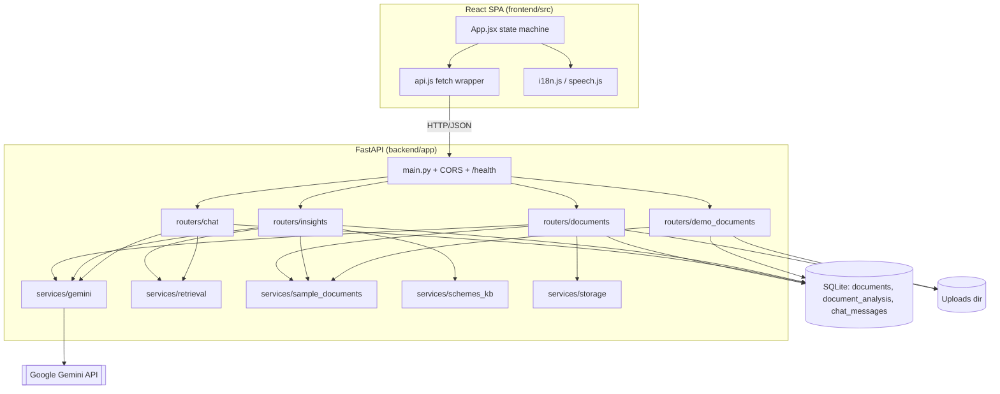

# JanMitra AI — Technical Report

## Executive Summary

JanMitra AI is a multilingual financial and legal literacy assistant for Indian citizens. It is a two-tier web application: a **React 19 + Vite** single-page app and a **Python FastAPI** backend that wraps **Google Gemini** for document understanding and generation, persists state in **SQLite**, and serves a small, well-factored REST API. The system converts an uploaded (or curated demo) document into a structured snapshot, ranked risks, rights/responsibilities, a citizen action plan, matched government schemes, suggested questions, and a grounded chat experience — all language-aware across English, Hindi, Bengali, Marathi, Tamil, and Telugu.

The design prioritizes **safety** (answers grounded in document text, citations, disclaimers, guardrails), **demo reliability** (deterministic curated samples that bypass the LLM), and **resilience on free-tier infrastructure** (multi-model fallback, backoff, cold-start UX). The LLM is isolated in a single module so providers can be swapped, and retrieval is abstracted behind a seam ready for a future RAG implementation.

## Problem Statement

Indian citizens routinely face documents — loan/KCC notices, rental agreements, ration-card and PDS letters, insurance policies — written in legalese and bureaucratic language. They need to know, in their own language: *What does this say? What could go wrong? What must I do, and by when? What official help or schemes apply?* Existing options (asking an agent, paying a professional, or guessing) are slow, costly, or risky. The product must inform and empower **without** giving binding legal/financial advice or guaranteeing eligibility.

## Requirements Analysis

**Explicit requirements (from README/vision):**
- Upload and understand PDFs/images via Gemini; multilingual UI and generated content (6 languages).
- Risk dashboard, rights/responsibilities, scheme discovery, suggested questions, action plan, grounded chat with citations.
- Demo document mode (`GET /api/demo-documents`, `POST /api/demo-documents/{id}`).
- Scheme personalization via query params; action-plan and delete endpoints.
- No-login persistence (SQLite + browser localStorage); offline report export; TTS.
- Education-level adaptation (basic/standard/advanced).

**Implicit requirements (from implementation):**
- Robustness to Gemini `429/503` (model fallback chain + backoff in `gemini._generate`).
- Deterministic demo output so judging is not blocked by quota (`sample_documents`).
- File-type/size validation (`storage.is_allowed`, 20 MB cap).
- CORS correctness incl. trailing-slash normalization (`config.cors_origin_list`).
- Cold-start tolerance for free-tier hosting (keep-alive workflow + UX messaging).
- Graceful empty-result handling (action-plan fallback; `_clean` to drop unknown keys).

## Architecture Overview

**Layered architecture:**

- **Presentation (frontend):** `App.jsx` orchestrates a guided-journey state machine; components render tabbed panels; `api.js` is the transport layer; `i18n.js`/`speech.js` provide localization and voice.
- **API layer (routers):** `documents`, `demo_documents`, `chat`, `insights` — thin HTTP handlers, validation, persistence orchestration.
- **Service layer:** `gemini` (LLM), `retrieval` (context selection seam), `sample_documents` (deterministic demo data), `schemes_kb` (static catalog), `storage` (file handling).
- **Data layer:** `database.py` (SQLite, 3 tables) and the uploads directory on disk.
- **External:** Google Gemini API.



## Component Analysis

### 1. `app/main.py` — Application entrypoint

- **Purpose:** Build the FastAPI app, configure CORS, run startup, expose health, wire routers.
- **Responsibilities:** `lifespan` calls `init_db()` and logs config; `CORSMiddleware` from `settings.cors_origin_list`; includes the four routers.
- **Inputs/Outputs:** HTTP requests in; JSON responses out. `/health` returns status, `gemini_configured`, allowed origins.
- **Dependencies:** `config`, `database`, routers.
- **Runtime behavior:** Initializes the SQLite schema on boot; warns if CORS origins are empty.

### 2. `app/config.py` — Settings

- **Purpose:** Load env-driven config via pydantic-settings.
- **Key fields:** `gemini_api_key`, `gemini_model`, `gemini_fallback_models`, `database_path`, `upload_dir`, `cors_origins`.
- **Key method:** `cors_origin_list` strips whitespace and trailing slashes (so `https://x.app/` matches the browser Origin). `get_settings()` is `lru_cache`d as a singleton.

### 3. `app/database.py` — Persistence

- **Purpose:** SQLite connection factory + schema init.
- **Key methods:** `get_db_path` (ensures parent dir), `get_connection` (`Row` factory, `PRAGMA foreign_keys = ON`, `check_same_thread=False`), `init_db` (idempotent `executescript`).
- **Schema:** `documents`, `document_analysis` (1:1, `ON DELETE CASCADE`), `chat_messages` (N:1, cascade).

### 4. `app/models.py` — Schemas

- **Purpose:** Pydantic request/response contracts.
- **Key classes:** `DocumentSummary`, `DocumentAnalysis`, `DemoDocument*`, `ChatRequest/Response/Message`, `Citation`, `RiskItem/RiskReport`, `RightsReport`, `SchemeSuggestion/SchemeReport`, `ActionPlan`, `SuggestedQuestions`. `EducationLevel = Literal["basic","standard","advanced"]`. Disclaimers are default field values on `SchemeReport`/`ActionPlan`.

### 5. `app/routers/documents.py` — Document lifecycle

- **Responsibilities:** Upload (`POST /api/documents`), list, get, delete, analyze (`POST /{id}/analyze`), get analysis.
- **Inputs:** multipart file; validated via `storage.is_allowed` and 20 MB cap.
- **Outputs:** `DocumentSummary`, `DocumentAnalysis`.
- **Key logic:** `analyze_document` routes demo IDs to `sample_documents`, else reads file bytes and calls `gemini.analyze_document`; upserts `document_analysis` and flips status to `analyzed`. Delete removes the row (cascades) and unlinks the stored file.

### 6. `app/routers/insights.py` — Insight generation

- **Responsibilities:** `risk`, `rights`, `action-plan`, `suggested-questions`, `schemes` under `/api/documents/{document_id}`.
- **Pattern:** each endpoint checks `sample_documents.sample_id_from_document_id`; demo → deterministic data; real → `_context_or_404` (document text) then the matching `gemini.*` call. `_clean(data, model)` filters to known model fields to avoid validation errors.
- **Schemes:** collects eligibility query params, drops empties, passes `schemes_kb.scheme_catalog_text()` to `gemini.match_schemes`.

### 7. `app/routers/chat.py` — Grounded Q&A

- **Responsibilities:** `POST /{id}/chat` (answer) and `GET /{id}/chat` (history).
- **Behavior:** loads document context (404 if not analyzed), loads prior messages, calls `gemini.chat_about_document`, persists user + assistant messages with citations JSON and language. Returns `ChatResponse(reply, citations, language)`.

### 8. `app/routers/demo_documents.py` — No-upload demo flow

- **Responsibilities:** list curated samples; load one (`load_sample`) which writes the sample text to disk, upserts `documents` + `document_analysis` rows pre-marked `analyzed`, and returns summary + analysis.

### 9. `app/services/gemini.py` — LLM layer (core)

- **Purpose:** Single point of Gemini integration.
- **Key functions:** `analyze_document`, `chat_about_document`, `extract_risks`, `extract_rights`, `suggest_questions`, `generate_action_plan`, `match_schemes`.
- **Infrastructure:** `_get_client` (lazy, lru_cache, raises `GeminiUnavailable` 503 without a key), `_generate` (JSON-mode option, retries with `time.sleep(2*(attempt+1))` on 429/503, then next model), `_model_chain` (primary + de-duped fallbacks), `_extract_json` (strips code fences, falls back to brace-slicing), `_language_instruction` (per-language output rules).
- **Safety:** prompts mandate "use ONLY the document content", "never invent", citation requirement, and a "not in the document" fallback. `generate_action_plan` returns hand-written EN/HI fallbacks when the key is missing or the model returns nothing.

### 10. `app/services/retrieval.py` — Context seam

- **Purpose:** Return document text as LLM context. Whole-document strategy today; `query` parameter reserved for future ranked-chunk RAG. Returns `None` if not analyzed → drives 404s.

### 11. `app/services/sample_documents.py` — Deterministic demo data

- **Purpose:** Three `SampleDocument` dataclasses with full raw text and curated EN/HI analysis, risks, rights, action plans, schemes, and questions. `load_sample` persists a demo doc; `sample_id_from_document_id` recognizes IDs of form `demo-{sample_id}-{uuid}`.

### 12. `app/services/schemes_kb.py` — Scheme catalog

- **Purpose:** Static list of ~19 central schemes (name, category, summary, audience, official URL). `scheme_catalog_text()` renders a compact catalog string for the model.

### 13. `app/services/storage.py` — File handling

- **Purpose:** Allowed content types (PDF/PNG/JPEG/WebP/TIFF), 20 MB cap, `save_upload` writes `{document_id}{suffix}` under the uploads dir.

### 14. Frontend (`frontend/src`)

- **`App.jsx`:** holds all state (doc, analysis, risk, rights, schemes, actionPlan, loading/errors, language, activeSection), `loadInsight` wrapper, report builder (`buildReport` → standalone HTML), recent-docs localStorage, and `actionableError` hints. `SECTIONS = [snapshot, action-plan, risks, rights, schemes, chat]`.
- **`api.js`:** `request()` wrapper with network-failure hints; `toQuery()` builds query strings; one function per endpoint.
- **Components:** `Upload`, `Chat`, `RiskDashboard`, `RightsPanel`, `SchemesPanel`, `ActionPlanPanel`, `DocumentSnapshot`, `GuidedJourney`, `AshokaChakra`.
- **`i18n.js`:** `LANGUAGES`, `SECTION_LABELS`, and a large `STRINGS` table across the 6 languages plus `outputLanguage` mapping (code → English language name sent to the backend).
- **`speech.js`:** maps language → BCP-47 locale and uses `speechSynthesis`.

## Execution Flow

Realistic interaction — a farmer reviewing a KCC notice demo in Hindi:

```
User clicks "Show sample documents" → loads "Kisan Credit Card renewal notice", language=Hindi
  → GET /api/demo-documents (list)  [api.js getDemoDocuments]
  → POST /api/demo-documents/farmer-kcc-notice?language=Hindi
      → sample_documents.load_sample: writes sample text to uploads/samples,
        upserts documents + document_analysis (status='analyzed'),
        returns DocumentSummary + DocumentAnalysis (Hindi)
  → App stores doc + analysis; renders Snapshot tab
User opens "Risks" tab
  → GET /api/documents/demo-farmer-kcc-notice-<uuid>/risk?language=Hindi
      → insights.risk: sample_id matched → sample_documents.risk_for (deterministic Hindi)
User opens "Schemes" tab, sets state=Maharashtra, occupation=Farmer
  → GET /.../schemes?state=...&occupation=...&language=Hindi
      → demo path returns curated schemes (PM-KISAN, KCC, PMFBY)
User asks in chat: "नवीनीकरण की आखिरी तारीख क्या है?"
  → POST /.../chat  {message, education_level, language:'Hindi'}
      → retrieval.get_document_context (raw text)
      → gemini.chat_about_document → JSON {reply, language, citations}
      → persists user + assistant messages
  → Chat renders reply + citation; optional TTS via speech.js
User clicks "Download report" → buildReport() generates standalone HTML; "Save PDF" triggers print
```

For a **real upload**, the only differences are: `POST /api/documents` (file) → `POST /{id}/analyze` (Gemini extraction) before insights, and every insight/chat call hits the live `gemini.*` functions instead of curated data.

## Data Flow Analysis

- **Sources:** uploaded files (disk), demo sample text (in-code), Gemini responses, the static scheme catalog, and citizen eligibility query params.
- **Processing:** extraction → structured `DocumentAnalysis`; insight prompts over stored `raw_text`; JSON parsed by `_extract_json`; filtered by `_clean`.
- **Storage:** `documents` (metadata + stored_path + status), `document_analysis` (`raw_text` + `extraction_json`), `chat_messages` (role/content/citations/language). Recent-doc list lives only in browser localStorage.
- **Output:** JSON to the SPA; rendered panels; exportable standalone HTML / browser PDF / copyable text report.

## AI / Agent / LLM Analysis

- **Models:** Default `gemini-2.5-flash`; fallbacks `gemini-2.5-flash-lite,gemini-flash-latest` (configurable). Multimodal `Part.from_bytes` for PDF/image extraction.
- **Prompting approach:** Task-specific prompt templates (`EXTRACTION_PROMPT`, `CHAT_SYSTEM_PROMPT`, `RISK_PROMPT`, `RIGHTS_PROMPT`, `QUESTIONS_PROMPT`, `ACTION_PLAN_PROMPT`, inline scheme prompt). All request **JSON-only** output (`response_mime_type="application/json"`) and are appended with a `_language_instruction`.
- **Workflow:** Not an autonomous agent — a set of single-shot, structured generations per insight, plus a stateful chat that includes the last 6 turns of history as context.
- **Reasoning pipeline:** document text in → grounded structured JSON out → Pydantic validation → UI. No tool-calling; "retrieval" is whole-document context.
- **Safety considerations:** "use ONLY the document content / never invent", citation requirement, "not found in document" guardrail, mandatory disclaimers, deterministic demo data, and EN/HI action-plan fallbacks. **Gap:** no explicit prompt-injection defense for adversarial uploaded documents (noted as future work in `vision.md`).

## API Analysis

Base path `/api`. Interactive docs at `/docs`. No authentication (by design).

| Method | Path | Request | Response |
| --- | --- | --- | --- |
| GET | `/health` | — | status, `gemini_configured`, allowed origins |
| POST | `/api/documents` | multipart `file` | `DocumentSummary` (201) |
| GET | `/api/documents` | — | `DocumentList` |
| GET | `/api/documents/{id}` | — | `DocumentSummary` |
| DELETE | `/api/documents/{id}` | — | 204 |
| POST | `/api/documents/{id}/analyze` | `?language` | `DocumentAnalysis` |
| GET | `/api/documents/{id}/analysis` | — | `DocumentAnalysis` |
| GET | `/api/documents/{id}/risk` | `?language` | `RiskReport` |
| GET | `/api/documents/{id}/rights` | `?language` | `RightsReport` |
| GET | `/api/documents/{id}/action-plan` | `?language` | `ActionPlan` |
| GET | `/api/documents/{id}/suggested-questions` | `?language` | `SuggestedQuestions` |
| GET | `/api/documents/{id}/schemes` | `?query,state,age,occupation,income_band,category,residence,gender,language` | `SchemeReport` |
| POST | `/api/documents/{id}/chat` | `ChatRequest{message, education_level, language}` | `ChatResponse{reply, citations, language}` |
| GET | `/api/documents/{id}/chat` | — | `ChatHistory` |
| GET | `/api/demo-documents` | — | `DemoDocumentList` |
| POST | `/api/demo-documents/{sample_id}` | `?language` | `DemoDocumentLoadResponse` |

**Errors:** `415` unsupported type, `413` oversize, `404` not found/not analyzed, `400` empty message, `503` `GeminiUnavailable`.

## Database Analysis

```mermaid
erDiagram
  documents ||--o| document_analysis : has
  documents ||--o{ chat_messages : has
  documents {
    TEXT id PK
    TEXT filename
    TEXT content_type
    TEXT stored_path
    TEXT status
    TEXT created_at
  }
  document_analysis {
    TEXT document_id PK_FK
    TEXT raw_text
    TEXT extraction_json
    TEXT created_at
  }
  chat_messages {
    INTEGER id PK
    TEXT document_id FK
    TEXT role
    TEXT content
    TEXT citations_json
    TEXT language
    TEXT created_at
  }
```

- **Models/relationships:** 1:1 document↔analysis, 1:N document↔messages, both `ON DELETE CASCADE`.
- **Query patterns:** simple parameterized CRUD; analysis stored as a JSON blob (`extraction_json`) plus a denormalized `raw_text` column used as chat/insight context; upserts via `ON CONFLICT`.

## External Integrations

- **Google Gemini API** (only external system).
  - **Why:** OCR/extraction over PDFs/images and all generative insight/chat.
  - **How:** `google-genai` client, lazily constructed with the API key; `generate_content` in JSON mode; multimodal byte parts for files.
  - **Failure handling:** `_generate` retries `429/503` with linear backoff, then walks the fallback model chain; total failure raises `GeminiUnavailable` (503). Missing key raises 503 immediately. Frontend maps these to retry/cold-start hints.

## Configuration Analysis

- **Env vars (backend, `.env.example`):** `GEMINI_API_KEY`, `GEMINI_MODEL`, `GEMINI_FALLBACK_MODELS`, `DATABASE_PATH`, `UPLOAD_DIR`, `CORS_ORIGINS`.
- **Env vars (frontend):** `VITE_API_BASE_URL` (baked at build time by Vite).
- **Files:** `render.yaml` (service, build/start commands, health check, env), `frontend/vercel.json` (build, output dir, SPA rewrites), `vite.config.js`, `eslint.config.js`.
- **Runtime options:** language per request, education level, scheme eligibility params; font-size steps and active section in the frontend.

## Security Review

- **Authentication:** None — intentionally no-login (documented in README/vision); avoids a false sense of security from local-only credentials.
- **Authorization:** None — any client knowing a `document_id` (random 32-hex UUID) can read/delete it. UUIDs provide obscurity, not access control.
- **Secrets management:** API key via env only; `.env` git-ignored; `GEMINI_API_KEY`/`CORS_ORIGINS` set as non-synced secrets in `render.yaml`.
- **Input validation:** content-type allowlist + 20 MB cap; parameterized SQL (no string interpolation) mitigates injection.
- **CORS:** explicit allowlist with trailing-slash normalization; `allow_credentials=True` with `allow_methods/headers=["*"]`.
- **Risks:** (1) no auth/ownership checks on documents; (2) no rate limiting → quota/DoS exposure; (3) prompt injection from malicious uploaded text is unmitigated; (4) `allow_credentials=True` combined with broad methods/headers is acceptable only with a strict origin list; (5) free-tier ephemeral disk means data is not durable.

## Scalability Review

- **Bottlenecks:** Gemini latency/quota dominate; synchronous handlers + retry `sleep` can hold worker threads; single SQLite file with `check_same_thread=False` serializes writes.
- **Horizontal scaling:** App layer is mostly stateless, but local SQLite + local uploads dir prevent multi-instance scale-out without a shared DB and object storage.
- **Storage growth:** `raw_text`, `extraction_json`, and chat rows grow per document; no retention/cleanup beyond manual delete.
- **Infra limits:** Render free tier sleeps after idle and uses an ephemeral filesystem (mitigated by keep-alive workflow; durability needs a paid disk).

## Reliability Review

- **Error handling:** Clean HTTP errors; LLM failures funnel to 503 via `GeminiUnavailable`; `_clean` and action-plan fallbacks prevent broken responses; frontend wraps every call in `loadInsight` with per-key loading/error state and actionable hints.
- **Logging:** `logging.getLogger("janmitra")` logs startup config/CORS warnings; no structured request logging or correlation IDs.
- **Monitoring:** `/health` endpoint + keep-alive pings; no metrics/tracing/alerting.
- **Recovery:** Idempotent schema init; deterministic demo path guarantees a working flow even during a Gemini outage.

## Maintainability Assessment

- **Modularity:** Strong. Clear router/service split; LLM and retrieval isolated behind narrow interfaces for future swaps.
- **Readability:** High. Small, well-documented modules; explanatory comments on non-obvious decisions (CORS normalization, retrieval seam).
- **Testability:** Decent seams (services are plain functions) but **no test suite present** in the repo — a notable gap.
- **Extensibility:** Easy to add insights (one prompt + one router function + one model), languages (i18n tables + `_language_instruction`), or schemes (catalog list).

## Technical Debt

- No automated tests (unit/integration/e2e) anywhere in the repo.
- Per-request `sqlite3.connect`/`close` (no pooling); blocking `time.sleep` retries in sync handlers.
- Whole-document context will hit token limits on long documents (RAG not yet implemented).
- Deterministic demo data is duplicated across EN/HI branches in `sample_documents.py` (large, repetitive file).
- No auth/ownership model; no rate limiting; no prompt-injection defense.
- `extraction_json` stored as opaque blob limits queryability of structured fields.

## Future Technical Roadmap (priority order)

1. **Add a test suite** — pytest for routers/services (mock Gemini), plus frontend smoke tests; CI on GitHub Actions.
2. **Durable storage** — managed Postgres + object storage for uploads; attach a Render disk in the interim (`render.yaml` note).
3. **AuthN/AuthZ + ownership** — managed auth provider; scope documents to users; private share links.
4. **Rate limiting & prompt-injection safeguards** — per-IP/user limits; sanitize/sandbox uploaded text in prompts.
5. **Real RAG** — implement chunking + embeddings behind `retrieval.get_document_context` for long docs.
6. **Async LLM calls** — move generation off request threads; add timeouts/circuit breakers.
7. **Observability** — structured logging, request IDs, metrics, and error alerting.
8. **Verified multilingual quality** — extend deterministic quality and test coverage beyond EN/HI.
